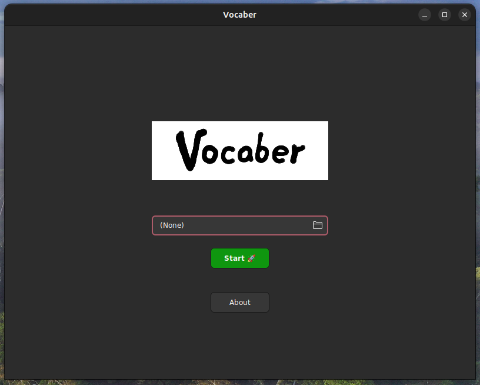
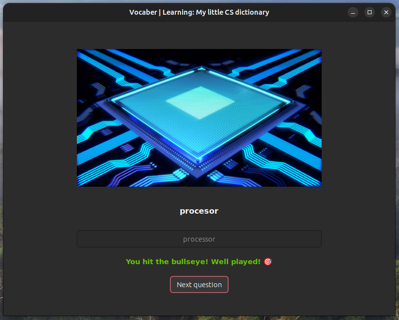
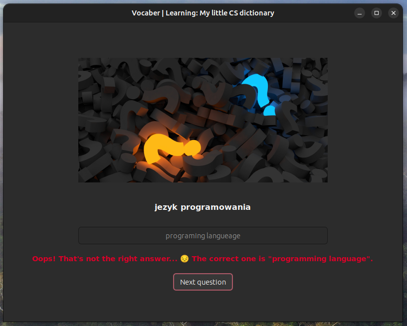

# VOCABER
   

**Status:** under development ⚠️


<div align="center">
    

_An app for learning vocabulary (and not only!)_
</div>


## About

Vocaber is an application that makes learning new vocabulary or terms easier. It makes revising material feel more like a game rather than a cramming.

The application is testing user on vocabulary (or definitions, for example), using a provided data file.

_Remark: application is under development and more testing options are likely to appear in the future._


## Requirements
- C++ compiler (eg. `sudo apt-get install build-essential`)
- CMake (eg. `sudo apt-get install cmake`)
- [wxWidgets](https://www.wxwidgets.org/) v3.2.2.1+ ([official installation guide](https://wiki.wxwidgets.org/Installing_and_configuring_under_Ubuntu))

  Brief wxWidgets installation guide:
  1. Install required packages: `sudo apt-get install libgtk-3-dev` (or more if required)
  2. Download the source code package, e.g. into `~/Libraries` directory (`wget https://github.com/wxWidgets/wxWidgets/releases/download/v3.2.2.1/wxWidgets-3.2.2.1.tar.bz2`)
  3. Extract the downloaded package (`tar -xvf wxWidgets-3.2.2.1.tar.bz2`) and change directory (`cd wxWidgets-3.2.2.1`)
  4. Configure the build options (eg. `./configure --enable-unicode`)
  5. Compile the library (`make -j4`; `-j4` specifies the number of parallel build jobs)
  6. Install the library (`sudo make install`)
  7. (_optional_) Test the installation (`cd samples/minimal && make && ./minimal`)


## Build and install

To build and install the application, first clone the repository and create a build directory:
```shell
git clone https://github.com/jakubpawlina/vocaber.git
cd vocaber
mkdir build
cd build
```

Then build the code (with wxWidgets root directory defined) and install the application.
```shell
cmake -DwxWidgets_ROOT_DIR=<wxWidgets directory path> ..
sudo make install
```
Make sure to replace `<wxWidgets directory path>` with actual path to your wxWidgets root directory (eg. `/home/user/Libraries/wxWidgets-3.2.2.1`).

**Currently only Linux installation is supported. For other systems app can be run in development mode (see below).**


## Development

To run the application in development mode proceed the steps from _Build and install_ section. However, define `-DDEBUG=true` for CMake and replace `sudo make install` with `make`. Running the application is possible by launching newly created `vocaber` executable file.
```shell
cmake -DwxWidgets_ROOT_DIR=<wxWidgets directory path> -DDEBUG=true ..
make
./vocaber
```

**Caution:** This version of application uses relative paths to the config files (e.g. images), so moving the executable file may lead to some problems. In this case you may want to create a link to the executable instead of moving it.

> Any contributions are welcome. [Here](https://docs.github.com/en/get-started/quickstart/contributing-to-projects) you can find more about contributing to projects.


## Preparing data files

_Vocaber_ asks you to load a proper JSON file when started. It should contain all information about the question set you want to learn. The basic structure of the file is:
```JSON
{
  "name": "Title of the set",
  "entries": [
    {
      "term": "first word",
      "definition": "translated word",
      "image": "path/to/the/image.png"
    },
    {
      "term": "second word",
      "definition": "the other translation",
      "image": "invalid/path.txt"
    },
    {
      "term": "third word",
      "definition": "the definition",
      "image": ""
    }
  ]
}
```

The file should contain:
- name of the set
- entries (e.g. words and their translations)
  - each entry should contain three fields: `term`, `definition` and `image`
  - the fields may contain empty values (especially there can be no image - then the default one is used).

The correct structure of the file is required to start the learning session. If you wish to add the images, make sure to use correct paths - otherwise the default image will be used.
The suggested way is to place the images in some directory and use absolute paths.

> You can browse some example data files placed in [`examples`](examples) directory.


## Usage

To use the application you have to build and install (or only run) it (see above).

After launch, the application asks to choose a vocaber data file (a JSON file, described above). If the file is correct, a new window is opened, and you can start typing answers. _Vocaber_ will validate them, display feedback and calculate the result.

If you wish, you can start multiple learning sessions independently. Each session will run in separate window and won't disturb the other ones.

## Screenshots

<div align="center">
    

_Screenshot: Start screen_
</div>

<div align="center">
    

_Screenshot: Correct answer_
</div>

<div align="center">
    

_Screenshot: Wrong answer_
</div>

## License

Copyright © 2023 [Jakub Pawlina](https://jakubpawlina.com).

---

The application uses wxWidgets library which is licensed under the [wxWindows Library Licence](https://www.wxwidgets.org/about/licence/).

The application uses nlohmann/json class which is licensed under the [MIT License](https://opensource.org/license/mit/).

Attribution notices for any images used are provided in relevant directories.


## Contact

If you have any suggestions or found a bug, I would like to invite you to open an issue on GitHub. In this case, please provide as detailed description as possible to facilitate the response.

You can always contact me using e.g. email from my GitHub profile.